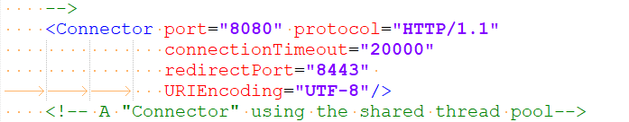

# 【原创】Servlet中post与get方法中文乱码问题

## 1、post中文乱码：

### a、获取参数乱码：

方法1、利用string方法对指定字符集进行转换，Tomcat默认使用iso-8859-1编码，修改为utf-8编码，例如在doPost方法中做如下修改：

```
String name = request.getParameter("varName");
String utf8Name = new String(name.getBytes("iso-8859-1"),"utf-8");
```

方法2、在doPost方法的第一行加入如下代码，用于对请求体中的字符集指定编码格式

```
request.setCharacterEncoding("UTF-8");
```

## 2、get中文乱码：

### a、获取url乱码：
在Tomcat8.0以下版本中，修改\apache-tomcat-7.0.56\conf\server.xml配置文件如图，加入URIEncoding=“UTF-8”,保存退出！



### b、响应乱码：

在doGet方法响应之前中加入

```
response.setContentType("text/html;charset=UTF-8");
```